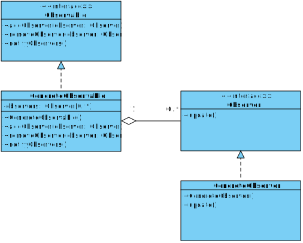

[Назад к описанию](https://github.com/Vladislav-Lyuminarskiy/OOP-course)

# Практическое занятие №5

## Темы занятия

- [Шаблон "Наблюдатель"](#Шаблон-Наблюдатель)
- [Шаблон "Итератор"](#Шаблон-Итератор)

## Шаблон "Наблюдатель"

Шаблон "наблюдатель" (поведенческий шаблон) представляет поведенческий шаблон проектирования, который использует отношение "один ко многим". В этом отношении есть один наблюдаемый объект и множество наблюдателей. И при изменении наблюдаемого объекта автоматически происходит оповещение всех наблюдателей.

Условия применения:
- Когда система состоит из множества классов, объекты которых должны находиться в согласованных состояниях.
- Когда общая схема взаимодействия объектов предполагает две стороны: одна рассылает сообщения и является главным, другая получает сообщения и реагирует на них. Отделение логики обеих сторон позволяет их рассматривать независимо и использовать отдельно друга от друга.
- Когда существует один объект, рассылающий сообщения, и множество подписчиков, которые получают сообщения. При этом точное число подписчиков заранее неизвестно и процессе работы программы может изменяться.

Формальная UML-диаграмма шаблона:



Формальное определение шаблона на `C++`:

```c++
#include <iostream>
#include <list>

using namespace std;

// Представляет наблюдаемый объект.
struct Observable
{
  // Добавить наблюдателя.
  virtual void addObserver(Observer *observer) = 0;
  // Удалить наблюдателя.
  virtual void removeObserver(Observer *observer) = 0;
  // Уведомить наблюдателей.
  virtual void notifyObservers() = 0;
};

// Конкретная реализация наблюдаемого объекта.
class ConcreteObservable : public Observable
{
  // Список наблюдателей.
  list<Observer *> observers;

public:
  virtual void addObserver(Observer *observer)
  {
    observers.push_back(observer);
  }

  virtual void removeObserver(Observer *observer)
  {
    observers.remove(observer);
  }

  virtual void notifyObservers()
  {
    for (Observer *observer : observers)
      observer->update();
  }
};

// Представляет наблюдателя, который подписывается
// на все уведомления наблюдаемого объекта.
struct Observer
{
  // Вызывается наблюдаемым объектом для уведомления наблюдателя.
  virtual void update() = 0;
};

// Конкретная реализация наблюдателя.
struct ConcreteObserver : public Observer
{
  virtual void update() {}
};
```

## Шаблон "Итератор"

Шаблон "состояние" (поведенческий шаблон) позволяет объекту изменять свое поведение в зависимости от внутреннего состояния. Применение шаблона позволяет вынести поведение, зависящее от текущего состояния объекта, в отдельные классы, и избежать перегруженности методов объекта условными конструкциями. Кроме того, при необходимости мы можем ввести в систему новые классы состояний, а имеющиеся классы состояний использовать в других объектах.

Условия применения:
- Когда необходимо осуществить обход объекта без раскрытия его внутренней структуры.
- Когда имеется набор составных объектов, и надо обеспечить единый интерфейс для их перебора.
- Когда необходимо предоставить несколько альтернативных вариантов перебора одного и того же объекта.

Формальная UML-диаграмма шаблона:


Формальное определение шаблона на `C++`:

```c++

```