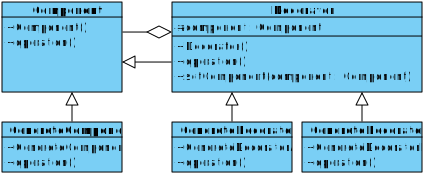

[Назад к описанию](../../README.md)

# Структурные шаблоны: "Фасад" и "Декоратор"

Темы занятия:
- [Шаблон "Фасад"](#Шаблон-Фасад)
- [Шаблон "Декоратор"](#Шаблон-Декоратор)

## Шаблон "Фасад"

Шаблон "фасад" (структурный шаблон) представляет шаблон проектирования, который позволяет скрыть сложность системы с помощью предоставления упрощенного интерфейса для взаимодействия с ней.

Условия применения:
- Когда имеется сложная система, и необходимо упростить с ней работу. Фасад позволит определить одну точку взаимодействия между клиентом и системой.
- Когда надо уменьшить количество зависимостей между клиентом и сложной системой. Фасадные объекты позволяют отделить, изолировать компоненты системы от клиента и развивать и работать с ними независимо.
- Когда нужно определить подсистемы компонентов в сложной системе. Создание фасадов для компонентов каждой отдельной подсистемы позволит упростить взаимодействие между ними и повысить их независимость друг от друга.

Формальная UML-диаграмма шаблона:


Формальное определение шаблона на `C++`:

```c++
// Компонент системы.
struct ComponentA
{
    void operationA1() {}
    void operationA2() {}
};

// Компонент системы.
struct ComponentB
{
    void operationB1() {}
    void operationB2() {}
};

// Компонент системы.
struct ComponentC
{
    void operationC1() {}
    void operationC2() {}
};

// Фасад, предоставляет единую точку для работы с компонентами.
class Facade
{
    ComponentA *componentA;
    ComponentB *componentB;
    ComponentC *componentC;

public:
    Facade(ComponentA *componentA,
           ComponentB *componentB,
           ComponentC *componentC) : 
             componentA(componentA),
             componentB(componentB),
             componentC(componentC) {}

    void operation1()
    {
        componentA->operationA1();
        componentB->operationB1();
        componentB->operationB2();
    }

    void operation2()
    {
        componentA->operationA2();
        componentB->operationB1();
        componentC->operationC1();
        componentC->operationC2();
    }
};

void main()
{
    Facade facade(new ComponentA(), new ComponentB(), new ComponentC());
    facade.operation1();
    facade.operation2();
}
```

## Шаблон "Декоратор"

Шаблон "декоратор" (структурный шаблон) представляет структурный шаблон проектирования, который позволяет динамически подключать к объекту дополнительную функциональность.

Условия применения:
- Когда надо динамически добавлять к объекту новые функциональные возможности. При этом данные возможности могут быть сняты с объекта
- Когда применение наследования неприемлемо. Например, если нам надо определить множество различных функциональностей и для каждой функциональности наследовать отдельный класс, то структура классов может очень сильно разрастись. Ещё больше она может разрастись, если нам необходимо создать классы, реализующие все возможные сочетания добавляемых функциональностей.

Формальная UML-диаграмма шаблона:



Формальное определение шаблона на `C++`:

```c++
// Абстрактный компонент.
struct Component
{
    virtual void operation() = 0;
};

// Реализация компонента, в которую с помощью декоратора
// добавляется новая функциональность.
struct ConcreteComponent : public Component
{
    virtual void operation() override {}
};

// Абстрактный декоратор.
class Decorator : public Component
{
protected:
    // Декорируемый объект.
    Component *component;

public:
    void setComponent(Component *component)
    {
        this->component = component;
    }

    virtual void operation() override
    {
        if(component) component->operation();
    }
};

// Реализация декоратора, предоставляет дополнительную функциональность,
// которой должен быть расширен декорируемый объект.
struct ConcreteDecoratorA : public Decorator
{
    virtual void operation() override
    {
        Decorator::operation();
    }
};

struct ConcreteDecoratorB : public Decorator
{
    virtual void operation() override
    {
        Decorator::operation();
    }
};
```